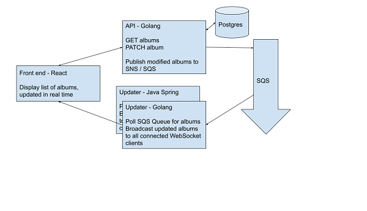

## Updater
Java Spring Implementation of WebSocket Server

Polls a queue for updated data

Broadcasts realtime updates to WebSocket clients

System Overview



## Example API requests to exercise the system
```
$ curl api-1-golang:8080/albums
$ curl -X PATCH api-1-golang:8080/albums/1 --data '{"id": 1, "price": 11.22}'
```